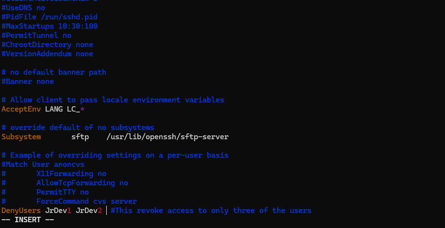

# TASK 1

# USER AND ROLES MANAGEMENT

Your company recently hired five new developers who need access to the development server. Your task is to:

1. Create user accounts for them and add them to the developers group.\

2. Ensure they have read and execute permissions for /var/www/project but cannot modify files

3. Restrict SSH access for two of them, who should only log in locally.

# Created a Bash Script to Automate the Whole Processes

***

    #!/usr/bin/bash 

## **SOLUTION 1**

### **1. CREATE USER ACCOUNT FOR THEM AND ADD THEM TO DEVELOPER GROUP.**

### STEP 1

 **- Create  all new Users**

    Sudo useradd JrDev1

    sudo useradd JrDev2

    sudo useradd Dev3

    sudo useradd TeamLead

    sudo useradd TeamLead2 

### STEP 2

 **- Create Developers Group**

    sudo groupadd Developers
 
            

### STEP 3

**- Add All New Users To Developers Group**

    sudo usermod -aG Developers JrDev1

    sudo usermod -aG Developers JrDev2

    sudo usermod -aG Developers Dev3

    sudo usermod -aG Developers TeamLead

    sudo usermod -aG Developers TeamLead2

### STEP 4

**- Print All Users in Developers Group**

    getent group Developers | awk -F: '{print $4}'

### **2. ENSURE THEY HAVE READ AND EXECUTE PERMISSION FOR /var/www/project BUT CANNOT MODIFY FILES**

### STEP 1

 **- Creating The /var/www/project File**

    sudo mkdir -p /var/www/project

### STEP 2

 **- Changing Ownership Of /var/www/project To Developers Group**

    sudo chown -R :Developers /var/www/project

****************

### STEP 3

 **- Give Group Developer Permission to only execute and read /var/www/project but not modifty it**

    sudo chmod 750 /var/www/project

### **3. RESTRICT SSH ACCESS FOR TWO OF THEM, WHO SHOULD LOGIN LOCALLY**

****************

### STEP 1

 **- start ssh service**

        sudo service ssh start

****************

### STEP 2

 **- To confirm if SSH is working**

        sudo service ssh status

*******

### STEP 3

 * Edit the /etc/ssh/sshd_config to deny ssh access to JrDev1 & JrDev2**

        sudo vim /etc/ssh/sshd_config

* Screenshot of Vim Editor is Shown Below

    

****

### STEP 4

* To Restart SSH

        sudo service ssh restart

* Screenshot to Confirm if Users JrDev1 & JrDev2 can ssh

## Here is a Screenshot of Bash Script output

